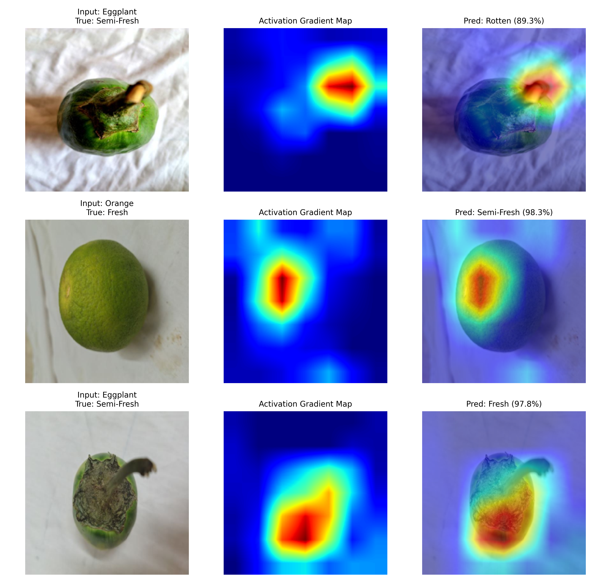

# Automated Produce Freshness Classification & Biological Explainability

An end-to-end computer vision pipeline developed in PyTorch to classify agricultural produce freshness across three maturity/degradation stages (**Fresh**, **Semi-Fresh**, and **Rotten**) spanning 8 produce varieties. 

The system implements a two-stage transfer learning strategy with **EfficientNet-B0**, validates model interpretability using **Grad-CAM**, and deploys an **uncertainty safeguard (Shannon Entropy)** to prevent overconfident predictions on out-of-distribution (OOD) images.

---

## 📦 Dataset Attribution & Source

* **Dataset Name:** AgriFreshNET
* **Dataset Source / URL:** [10.17632/42m5tb7yv9.1](https://data.mendeley.com/datasets/42m5tb7yv9/1)

### Dataset Summary
* **Validated Images:** 14,120 unique, verified image instances (audited for corruptions and duplicate MD5 hashes).
* **Target Classes (3):** `Fresh` (4,710 images), `Semi-Fresh` (4,693 images), `Rotten` (4,717 images).
* **Produce Varieties (8):** Banana, Bitter Melon, Cucumber, Eggplant, Orange, Papaya, Pineapple, and Tomato.
* **Splitting Strategy:** Compound stratified split (70% Train, 15% Validation, 15% Locked Test) preserving exact class proportions without data leakage.

---

## 📊 Empirical Progression & Benchmark Results

| Model / Stage | Feature Representation | Trainable Params | Validation Accuracy (%) | Macro-F1 | Semi-Fresh Recall (%) | Extreme Errors (Fresh ↔ Rotten) |
| :--- | :--- | :--- | :--- | :--- | :--- | :--- |
| **Baseline 0** | Handcrafted Color Moments + LBP Textures (Random Forest) | N/A | 86.54% | 0.8652 | 81.48% | 41 samples |
| **Baseline 1** | Pretrained ImageNet Features (Frozen EfficientNet-B0 Head) | 3,843 (0.1%) | 84.20% | 0.8380 | 79.50% | 18 samples |
| **Main Model (E2)** | **End-to-End Fine-Tuned EfficientNet-B0** | **4.01M (100%)** | **99.29%** | **0.9929** | **98.29%** | **0 samples** |

### Key Experimental Insights:
1. **Semi-Fresh Bottleneck Resolved:** Recall on the subtle degradation boundary jumped from **81.48%** to **98.29%**, demonstrating that spatial convolutional filters capture localized soft spots and lesions that global color statistics miss.
2. **Complete Elimination of Extreme Errors:** Fresh produce classified as Rotten (and vice-versa) dropped from 41 cases in the baseline to **0 cases** in the fine-tuned model.
3. **Representation Breakthrough:** Fine-tuning the backbone convolutional layers unlocked a 94.7% reduction in total classification errors compared to classical methods.

---

## 🔬 Explainable AI: Biological Validation with Grad-CAM

To ensure the neural network learns true biological degradation cues rather than photographic artifacts (such as backgrounds, table surfaces, or shadows), Gradient-Weighted Class Activation Mapping (Grad-CAM) was hooked into the final convolutional stage (`features[-1]`).

### Findings:
* **Background Suppression:** White fabric textures, cutting boards, and drop shadows receive near-zero activation (deep blue).
* **Organ-Level Attention:** The network focuses precisely on primary sites of physiological decay:
  * **Stem/Pedicel Desiccation:** Rapid moisture loss at the calyx.
  * **Degreening & Peel Oxidation:** Chlorophyll breakdown on fruit skins.
  * **Fungal Mycelium & Soft Lesions:** Localized necrotic patches.

---

## 🛡️ Uncertainty & Out-of-Distribution (OOD) Safeguard

Deep neural networks operating under a closed-world assumption often produce overconfident misclassifications when presented with unseen non-produce objects or severely corrupted images. 

To mitigate this, our inference pipeline integrates a **Shannon Entropy** ($H$) uncertainty check alongside a maximum confidence threshold:

$$H(p) = -\sum_{i=1}^{C} p_i \ln(p_i)$$

* **Confidence Threshold:** Minimum 80% (`confidence >= 0.80`)
* **Maximum Entropy Threshold:** Cutoff at 0.85 (`entropy <= 0.85`)
* **Abstention Policy:** Any sample failing either condition is flagged with status `REJECTED / UNCERTAIN (POSSIBLE OOD SAMPLE)` for mandatory human inspection.

